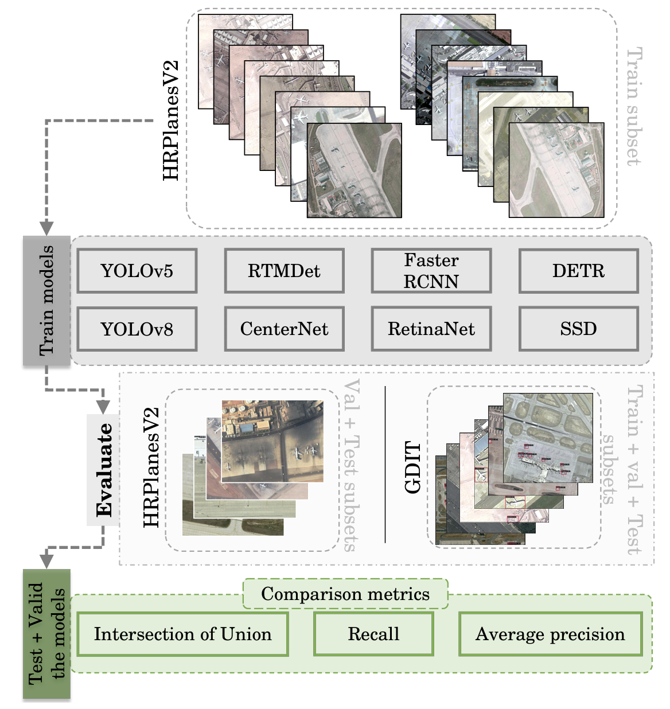
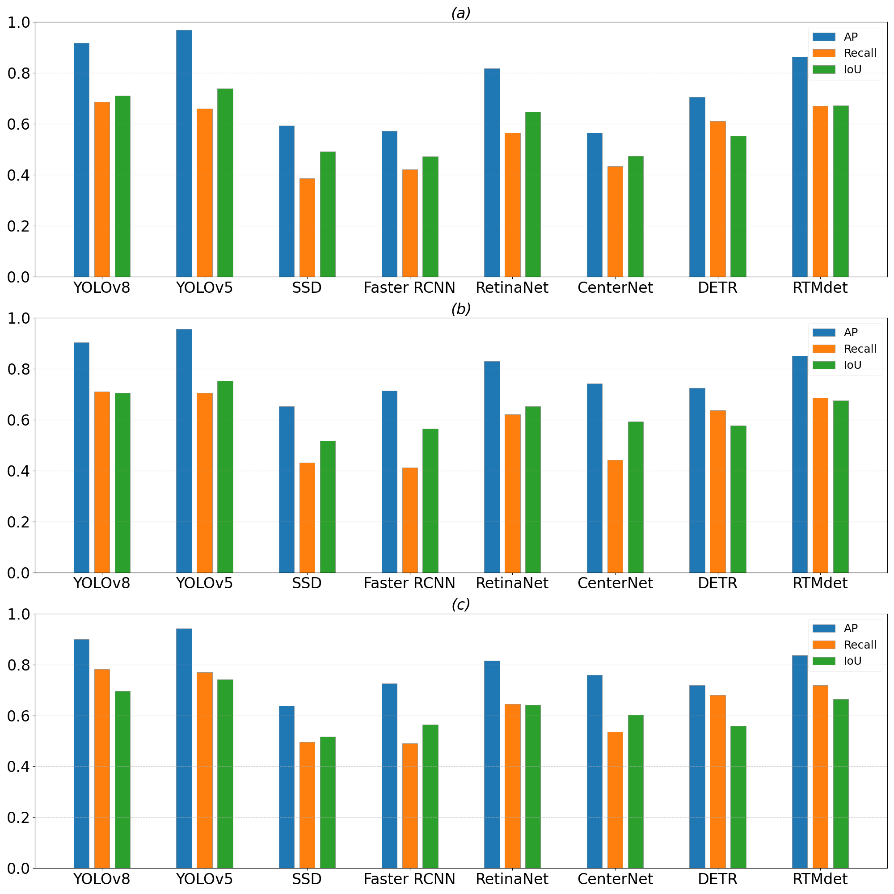
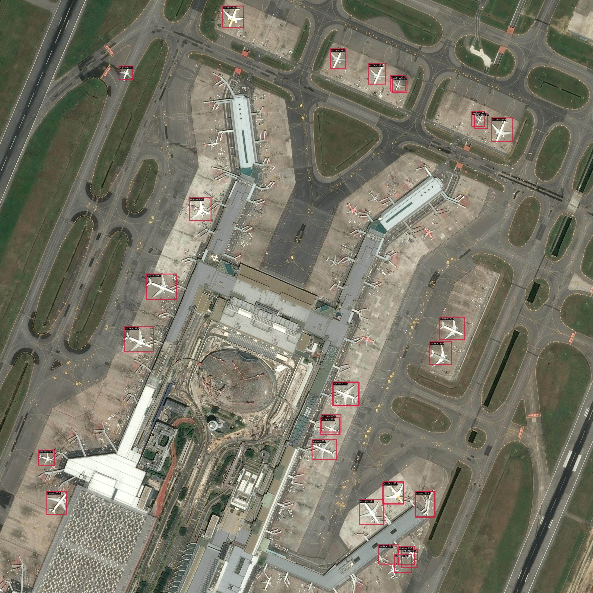

# FlightScope
Official implementation of the paper "FlightScope: A Deep Comprehensive Assessment of Aircraft Detection Algorithms in Satellite Imagery"
[ArXiV Preprint](https://arxiv.org/abs/2404.02877)

## Summary

This study compares multiple deep learning algorithms, including `Faster RCNN`, `DETR`, `SSD`, `RTMdet`, `RetinaNet`, `CenterNet`, `YOLOv5`, and `YOLOv8`, trained and evaluated on aerial images for the detection and localization of aircrafts. The graphical summary of the work is presented if the following figure:

<!---{:width="70%"}-->


The following video shows the inference of Barcelona Airport of the trained algorithms with a detection threshold of 70%. You can find the original video at [ShutterStock](https://www.shutterstock.com/video/clip-1023402088-barcelona-airport-top-view-aircraft-terminal-building).

[concatenated_video.webm](https://github.com/toelt-llc/FlightScope_Bench/assets/54261127/a5269a4b-9391-4e39-96a9-908802495206)

- [FlightScope](#flightscope)
  - [Summary](#summary)
  - [Datasets](#datasets)
    - [HRPlanesv2 Dataset](#hrplanesv2-dataset)
    - [GDIT Dataset](#gdit-dataset)
  - [Algorithms Brief Description](#algorithms-brief-description)
  - [Instructions](#instructions)
    - [Clone Repository](#clone-repository)
    - [Setup Conda Environment](#setup-conda-environment)
    - [Set Up Workflows](#set-up-workflows)
    - [Annotation Conversion](#annotation-conversion)
    - [Weights Download](#weights-download)
  - [Usage](#usage)
  - [Evaluation Metrics](#evaluation-metrics)
  - [Citation](#citation)
  - [Copyright Notice](#copyright-notice)

### Datasets:

- **HRPlanesv2 Dataset** (for the training and evaluation):

The HRPlanesv2 dataset contains 2120 VHR Google Earth images. To further improve experiment results, images of airports from many different regions with various uses (civil/military/joint) selected and labeled. A total of 14,335 aircrafts have been labeled. Each image is stored as a ".jpg" file of size 4800 x 2703 pixels, and each label is stored as YOLO ".txt" format. Dataset has been split into three parts as 70% train, 20% validation, and test. The aircrafts in the images in the train and validation datasets have a percentage of 80 or more in size. [Link](https://github.com/dilsadunsal/HRPlanesv2-Data-Set)

- **GDIT Dataset** (for evaluation):

The GDIT Aerial Airport dataset consists of aerial images (satellite/remote sensing) containing instances of parked airplanes. All plane types are grouped into a single named "airplane". The total number of images is 338 broadcasted between train, test and validation subsets. All the annotation are in yolo format as well. [Link](https://universe.roboflow.com/gdit/aerial-airport/browse?queryText=&pageSize=200&startingIndex=200&browseQuery=true)

## Algorithms Brief Description

The following table groups the 8 tested models:

| Model       | Description                                                                                                                                                                                         |
|-------------|-----------------------------------------------------------------------------------------------------------------------------------------------------------------------------------------------------|
| SSD         | [SSD](https://medium.com/axinc-ai/mobilenetssd-a-machine-learning-model-for-fast-object-detection-37352ce6da7d) is a real-time object detection algorithm that predicts bounding boxes and class scores for multiple fixed-size anchor boxes at different scales. It efficiently utilizes convolutional feature maps to achieve fast and accurate detection.                                            |
| Faster RCNN | [Faster-RCNN](https://blog.paperspace.com/faster-r-cnn-explained-object-detection/#:~:text=Faster%20R%2DCNN%20is%20a%20single%2Dstage%20model%20that%20is,traditional%20algorithms%20like%20Selective%20Search.) is a two-stage object detection framework. It employs a region proposal network (RPN) to generate potential bounding box proposals, combining them with deep feature maps for accurate object detection.                                        |
| CenterNet   | [CenterNet](https://towardsdatascience.com/centernet-explained-a7386f368962) is a single-stage object detection approach that focuses on predicting object centers and regressing bounding boxes. It achieves high accuracy through keypoint estimation for precise object localization.                                                                                                                                  |
| RetinaNet   | [RetinaNet](https://www.analyticsvidhya.com/blog/2022/09/retinanet-advanced-computer-vision/) is recognized for its focal loss, addressing the class imbalance issue in one-stage detectors. By combining a feature pyramid network with focal loss, RetinaNet excels in detecting objects at various scales with improved accuracy.                                                                                            |
| DETR        | [DETR](https://medium.com/visionwizard/detr-b677c7016a47) is a transformer-based object detection model that replaces traditional anchor-based methods with a set-based approach. It utilizes the transformer architecture to comprehend global context and achieve precise object localization.                                                                                                             |
| RTMdet      | [RTMdet](https://mmyolo.readthedocs.io/en/latest/recommended_topics/algorithm_descriptions/rtmdet_description.html) is an advanced object detection model that leverages a novel framework called Rotate to Maximum (RTM) to improve accuracy compared to traditional Faster R-CNN models. The model is effective in handling objects with varying orientations, resulting in improved detection accuracy. However, its computational complexity may impact performance compared to other state-of-the-art models. |
| YOLOv5      | [YOLOv5](https://sh-tsang.medium.com/brief-review-yolov5-for-object-detection-84cc6c6a0e3a#:~:text=YOLOv5%20uses%20the%20methods%20of,for%20detecting%20different%20scales%20targets) utilizes methods of anchor box refinement, PANet feature pyramid network, and CSPNet for detecting different scale targets. It improves accuracy and efficiency in object detection tasks.                                                          |
| YOLOv8      | [YOLOv8](https://arxiv.org/abs/2305.09972) introduces advancements in object detection by refining the architecture, incorporating feature pyramid networks, and optimizing the training pipeline. It enhances accuracy and speed in detecting objects.                                                                                                              |

## Instructions

### Clone Repository

```bash
sudo apt-get update && upgrade
```
```bash
git clone https://github.com/toelt-llc/FlightScope_Bench.git
cd FlightScope_Bench/
```

### Setup Conda Environment

To create conda environment, run the following code:

```bash
conda create --name flightscope python=3.8 -y
conda activate flightscope
```

Then proceed by following the instruction in the [**next step**](#3-set-up-workflows)

### Set Up Workflows

The study utilizes two popular deep learning frameworks for object detection:

- [mmdetection](https://github.com/open-mmlab/mmdetection)
  - The installation process for mmdetection is detailed in the [_mmdetection_install.ipynb](./_mmdetection_install.ipynb) notebook.

- [detectron2](https://github.com/facebookresearch/detectron2)
  - The setup for detectron2 is explained in [__algorithms_collection.ipynb](./__algorithms_collection.ipynb).

- [Ultralytics YOLO](https://github.com/ultralytics/)
  - Information about Ultralytics [YOLOv5](https://github.com/ultralytics/yolov5) and [YOLOv8](https://github.com/ultralytics/ultralytics) is available in [__algorithms_collection.ipynb](./__algorithms_collection.ipynb).


### Annotation Conversion

As the HRPlanesv2 dataset is provided with YOLO annotation (txt file with bounding boxes), conversion to JSON COCO annotation is necessary for detectron2 and mmdetection compatibility. The conversion process is detailed in "__data_collection.ipynb" using the [Yolo-to-COCO-format-converter](https://github.com/Taeyoung96/Yolo-to-COCO-format-converter) repository.

### Weights Download

The resulting weights of the trained deep learning model have are publically available on [Google-Drive](https://drive.google.com/file/d/13aXBJcxKXjqyq7ycAg4LIe8TEmrX-kxa/view?usp=sharing). These steps are also available at the begining of the [result_vizualiser.ipynb](./result_vizualiser.ipynb).

You can download and extract the files using the following commands:

```python
# Make sure you have the gdown lib installed other wise run the following line
pip install gdown

# upgrade gdown
pip install --upgrade gdown

# Download the file
!gdown https://drive.google.com/file/d/13aXBJcxKXjqyq7ycAg4LIe8TEmrX-kxa/view?usp=sharing

# Unzip it in the home folder
%unzip output_tensor.zip
```

## Usage
(Train from scratch)

All the training and inferences are given in the notebooks:

[SSD](./1_SSD.ipynb), [YOLO v5](./2_yolov5_aircraft.ipynb), [YOLO v8](./3_yolov8_aircraft.ipynb), [Faster RCNN](./4_Faster_RCNN.ipynb), [CenterNet](./5_CenterNet.ipynb), [RetinaNet](./6_RetinaNet.ipynb), [DETR](./7_DETR.ipynb), [RTMDet](./8_rtmdet.ipynb).

All the obtained results are given in the notebooks:

[9_result_vizualiser.ipynb](./9_result_vizualiser.ipynb), [10_evaluation_metrics.ipynb](./10_evaluation_metrics.ipynb) and [inference_tester.ipynb](./inference_tester.ipynb).

## Evaluation Metrics

The  evaluation metrics used for this project are: iou, recall and average precision. This histogram figure from the paper summerizes the obtained metrics:


Some previews of the results:

- Preview of detection results of CenterNet and DETR




- Bounding box mean average precision, respectively at IoU=0.5 and IoU=0.75


## Citation

If our work is useful for your research, please consider citing us:

```latex
@misc{ghazouali2024flightscope,
      title={FlightScope: A Deep Comprehensive Assessment of Aircraft Detection Algorithms in Satellite Imagery}, 
      author={Safouane El Ghazouali and Arnaud Gucciardi and Nicola Venturi and Michael Rueegsegger and Umberto Michelucci},
      year={2024},
      eprint={2404.02877},
      archivePrefix={arXiv},
      primaryClass={cs.CV}
}
```

## Copyright Notice

The provided code is based on the following open-source libraries:

- [Ultralytics](https://github.com/ultralytics/yolov5)
- [detectron2](https://github.com/facebookresearch/detectron2)
- [mmdetection](https://github.com/open-mmlab/mmdetection)

This code is free to use for research and non-commercial purposes.

---

This code is provided by [Safouane El Ghazouali](https://github.com/safouane95), PhD, Senior researcher AND [Arnaud Gucciardi](https://github.com/a-gucciardi).
For personal contact: [safouane.elghazouali@gmail.com](mailto:safouane.elghazouali@gmail.com).

